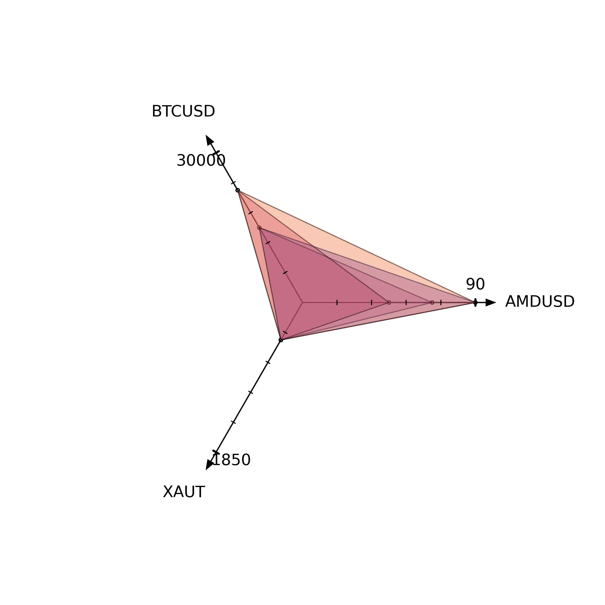

# FTX Collateral Estimator

Assessing USD collateral on FTX can be difficult on cross-margin with multiple positions. This tool helps traders estimate price impact on their collateral. This is especially helpful for leveraged positions to estimate liquidation prices.

Contributions and new ideas to model cross-margin positions are highly welcome ❤️️

