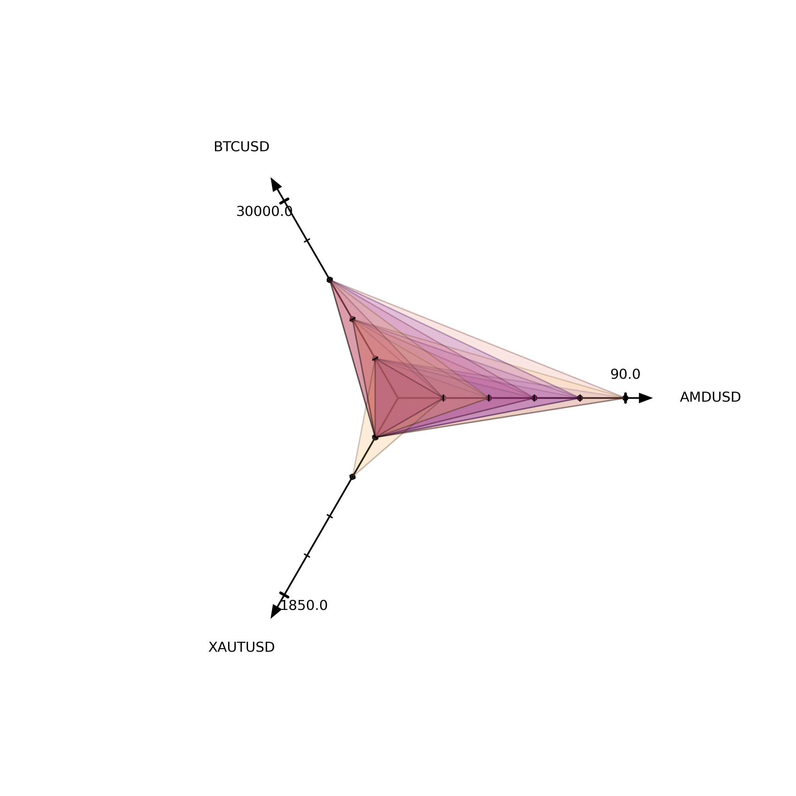

# FTX Collateral Estimator

This tool helps assess USD collateral on FTX for cross-margin positions.

* polygons show if USD collateral value is below a certain threshold
* positions are specified in `example.json`
    * `factor` specifies FTX weighting factor
    * `amount` is your current position at `price`

Contributions are highly welcome ❤️️